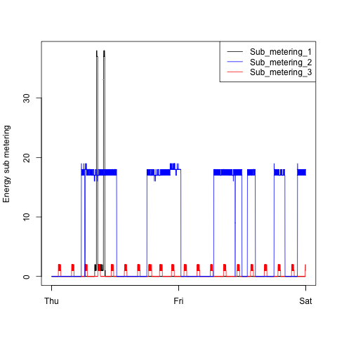
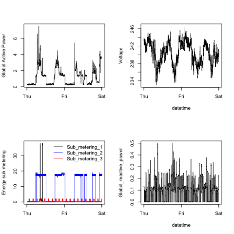

## About this Assignment

The instructions for this assignment can be found in the original README
here: https://github.com/rdpeng/ExData_Plotting1. The information below tells you what
you need to know to use this software in your own R environment.  

The **Assignment Deliverables** show each of the graphs required by the assignment.  The first graph
is the original example provided by the instructor.  The second graph is the output created by the code.

This code should not be viewed by other students in this Coursera class until after the deadline has passed.  The code
is being peer reviewed by other students also required to write their own code.

## Requirements

The scripts `plot1.R`, `plot2.R`, `plot3.R`, and `plot4.R` may each be sourced and executed independently. The scripts, in turn,
will create or overwrite existing files `plot1.png`, `plot2,png`, `plot3.png` and `plot4.png` respectively.  The source data
file is not included in this repository.

The scripts will download a [large ZIP file](https://d396qusza40orc.cloudfront.net/exdata%2Fdata%2Fhousehold_power_consumption.zip) of about 19.6 MB from the Internet and decompress a text file named `household_power_consumption.txt` of about 126.8 MB to your current working directly.  If you have already downloaded the data file and decompressed it, just set your current working directory to the location of the file before running the script.

The software has been tested on MacOS X Mavericks and Mac OS X Yosemite using RStudio Version 0.98.978 and R
 version 3.1.1 (2014-07-10, Platform: x86_64-apple-darwin13.1.0 64-bit).  The scripts require no additional packages beyond the base packages, but it will use the following packages if installed:
 
* **png** version 0.1-7
* **gdata** 2.13.3
* **RCurl** 1.95-4.3 

These libraries are optional and do not affect the PNG output required of the assignment.

## Assignment Deliverables

### Plot 1.R (480x480 PNG)

#### Example Given

#### Assignment Output
 

### Plot 2.R (480x480 PNG)

#### Example Given

#### Assignment Output
 

### Plot 3.R (480x480 PNG)

#### Example Given

#### Assignment Output
 

### Plot 4.R (480x480 PNG)

#### Example Given

#### Assignment Output
 
